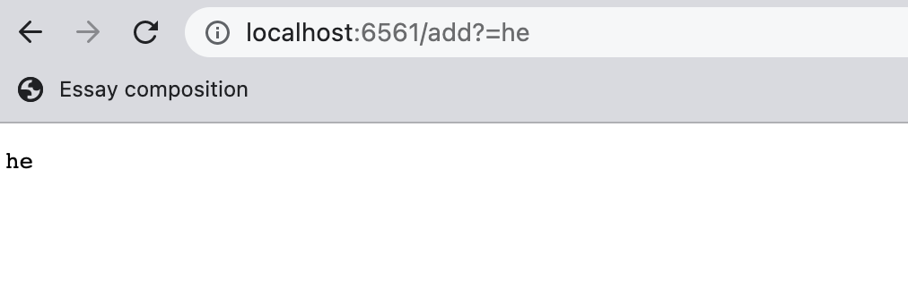
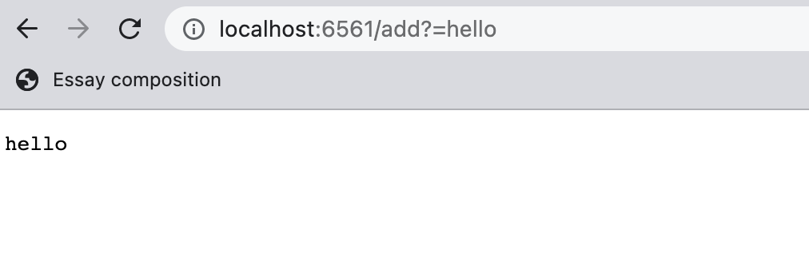
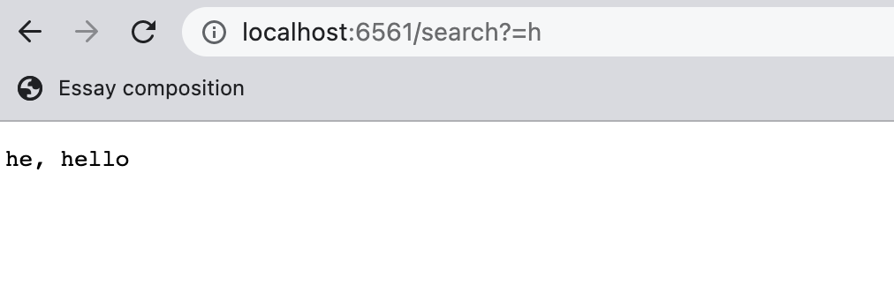
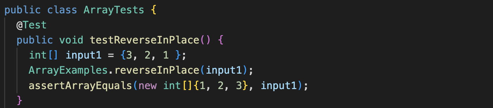
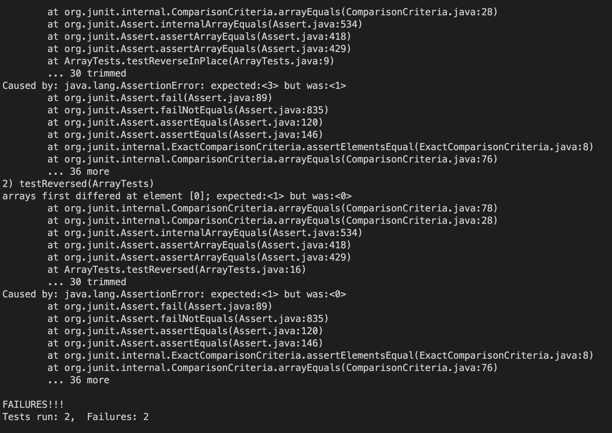
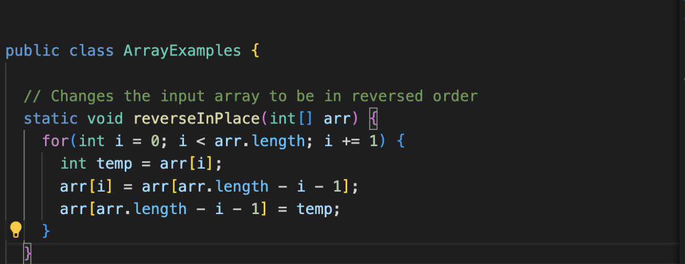
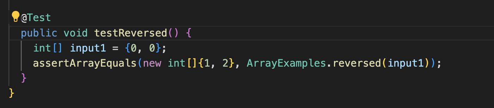
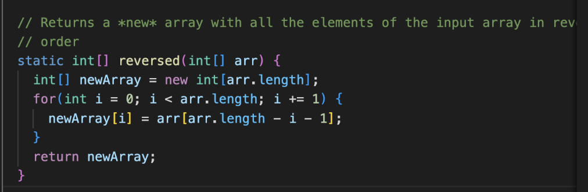

# **Part 1**
```
Adding strings
```

* For these two screenshots the method handlerequest() is used but only lines 13-17. The argument for this method is taking the URL in this case localhost:6561/add?=he and localhost:6561/add?=hello. Since we can add several strings, the argument will be different every time we write a different string, therefore, the URL will be disticnt in that the strings after the "add?=" are different each time. 






```
Searching strings
```
* For this last screenshot the method used is the same handlerequest() but from lines 19-28. The argument for this methos is taking the URL, which will be the same everytime the argument is passed except for the strings after the "search?=".



# **Part 2**

## Bug 1: testReverseInPlace() Method

* Failure-inducing input:
 
 * Symptom:
 
 * Bug fixed:
 

There was a failure of the test for the method testReverseInPlace() because it was updating the incorrect original array (arr) instead of adding the new reversed values to a new array (newArray). The bug causes this particular symptom for the above input because instead of returning {3, 2, 1} it would produce {3, 2, 3} as it would draw the last number to reverse from index 1 from the original array arr (index 0 from the final iteration is equal to 3).

## Bug 2: reversed() Method

* Failure-inducing input:
 
 * Symptom:
 
 * Bug fixed:
 

 There was a failure of the test for the method reversed() because  it was updating the incorrect array (original array) and not adding the new values to the newArray. Since the initialized newArray does not have any values yet, it would have returned {0, 0} instead of the reversed array.

 